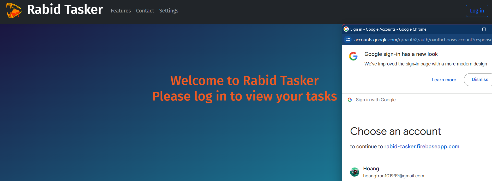

I am pursuing a Master of Science degree in Artificial Intelligence at Johns Hopkins Whiting School of Engineering 🏫, where I am learning advanced topics in machine learning, computer vision, natural language processing, and robotics. I have a strong background in biomedical engineering, with a Bachelor of Engineering degree from the University of Houston, and am in the process of obtaining the Data Science certification from IBM.

- 🌱 I’m currently learning about Artificial Intelligence at Johns Hopkins University 🏫
- 🌍 Languages: Python, MATLAB, SQL, Vietnamese, English
- 📫 How to reach me: hoangtran101999@gmail.com

#### My Community 👥:

  

## Featured Projects 💻:

###  [RABID TASKER](https://rabid-tasker.web.app/Home)

**[RABID TASKER](https://rabid-tasker.web.app/Home)** is a **a ✨revolutionary✨ task management tool that brings ancient task management into the future** built with **Google Firebase**. This project showcases my skills in **developing scalable web applications with real-time database capabilities, implementing user authentication and authorization systems, and creating intuitive user interfaces for seamless task management experiences**. You can check out the repository [here](https://github.com/cytoshell/RowdyHacksSpring2024/tree/main).

### [A Hybrid in Silico Model of the Rabbit Bulbospongiosus Nerve](https://docs.google.com/presentation/d/1i-H6iJv23251j5xhvtSrhFYicCKRRGS2/edit?amp%3Bouid=106798688794723663606&amp%3Brtpof=true&amp%3Bsd=true#slide=id.g1e18d793b26_0_3)

**This project** is a **method to construct a recruitment curve of a nerve in the bladder when stimulated by an electrode** built with **Sim4Life, ImageJ, Python**. This project showcases my skills in **computational modeling, image analysis, and programming with Python.**. You can check out the work [here](https://docs.google.com/presentation/d/1i-H6iJv23251j5xhvtSrhFYicCKRRGS2/edit?amp%3Bouid=106798688794723663606&amp%3Brtpof=true&amp%3Bsd=true#slide=id.g1e18d793b26_0_3).
## Get in Touch 📬

- **[LinkedIn](https://www.linkedin.com/in/hoang1802tran/)**
- **[Credly](https://www.credly.com/users/hoang-tran.09d2f0ee/badges)**

## My Stats:

 
  

 ## Total Achievement:

